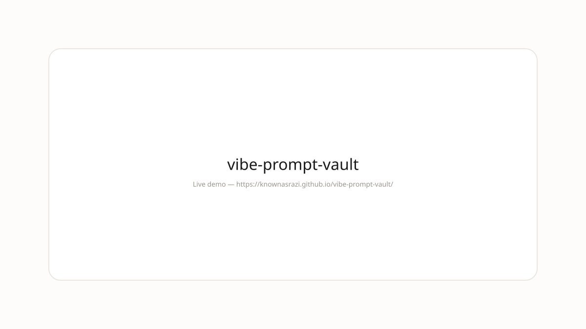

<div align="center">

  

</div>

---
## Demo



**Live:** https://knownasrazi.github.io/vibe-prompt-vault/

> Screenshot is a placeholder — Pages deploys on push to `main`.

---


# vibe-prompt-vault

> Local prompt manager for vibe coders - capture, organize, and reuse AI prompts.

**Capture once, vibe forever.** — built for vibe coders who ship.

---

## Manifesto

Clean over chrome. Stone over shadow. This is a tool that gets out of your way.

> "Local prompt manager for vibe coders - capture, organize, and reuse AI prompts."

No onboarding. No dashboard. Just open and go.

## Stack

- TypeScript + Vite
- Clean tokens: #fdfcfa / #ebe7e0 / #1a1a1a
- No tracking, no analytics by default

## Quick start

```bash
git clone https://github.com/knownasrazi/vibe-prompt-vault.git
cd vibe-prompt-vault
bun install
bun run dev
```

## License

MIT — [Razi](https://github.com/knownasrazi)
